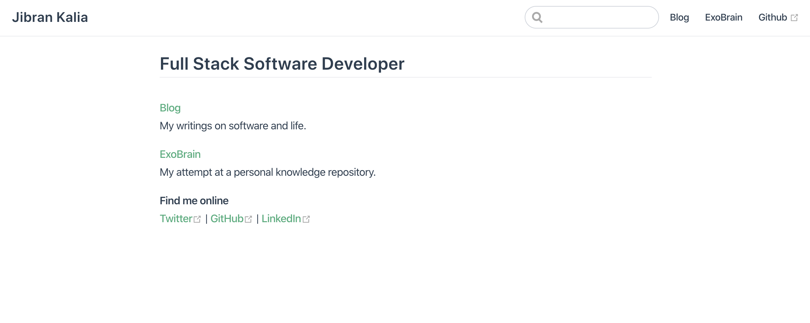
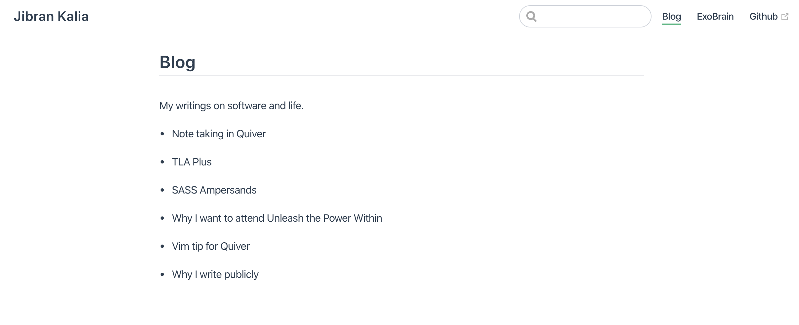
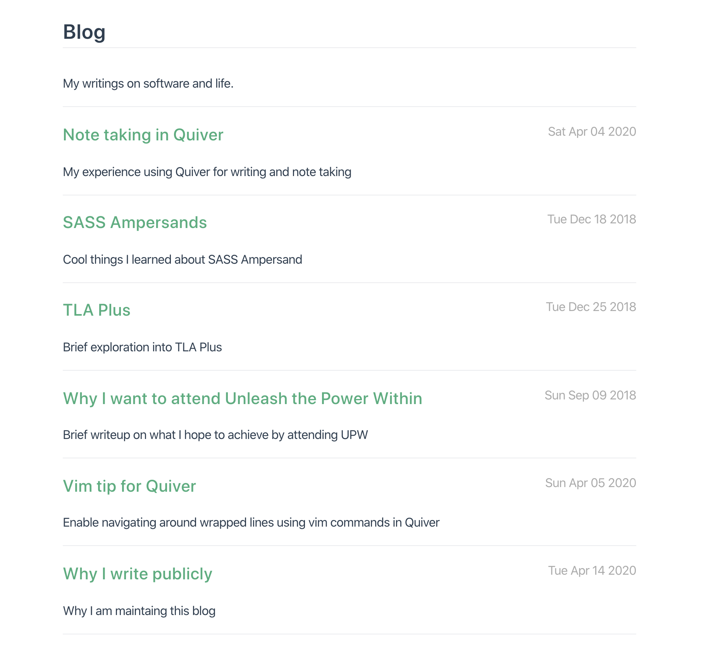

---
Create a blog using VuePress (Part 1)
date: "2020-04-20T15:32:33.874Z"
description: My experience using VuePress to create a blog - Part 1
state: editing
tags:
  - Vue.js
  - VuePress
  - Blog
---

# Create a blog using VuePress (Part 1)

## Background

After checking out Paul Copplestone's [awesome website](https://paul.copplest.one/), I decided I wanted to build my own blog using [VuePress](https://vuepress.vuejs.org/) as well.

## Installing VuePress

I started by following the instructions on the VuePress [Getting Started](https://vuepress.vuejs.org/guide/getting-started.html#getting-started) page.

```shell
# install globally
yarn global add vuepress

# create the project folder
mkdir personal-website && cd personal-website

# create a markdown file
echo '# Hello VuePress' > README.md

# start writing
vuepress dev
```

After running the dev command the website built successfully:
`success [21:04:56] Build f26917 finished in 132 ms! ( http://localhost:8080/ )`

This is what the intial website looked like:


## package.json

I then installed the local dependencies:

```shell
yarn add -D vuepress
mkdir docs
```

The package.json should now look like:

```js
{
  "devDependencies": {
    "vuepress": "^1.4.1"
  }
}
```

Finally, I added a few helper scripts to run the `dev` and `build` commands using yarn.

```js
"scripts": {
  "docs:dev": "vuepress dev docs",
  "docs:build": "vuepress build docs"
}
```

Before I committed the changes I added a Vue.js tailored `.gitignore` file:

```shell
curl -O https://raw.githubusercontent.com/vuejs/vuejs.org/master/.gitignore
```

This is what the [file directory](https://github.com/JibranKalia/personal-website/tree/86604298a74d41945ab3ac75bdbdb38bcea3b0a5) looks like at this point.

## Configuration

I then setup the `.vuepress` file based on the [official docs](https://vuepress.vuejs.org/guide/basic-config.html#config-file):

```js
// docs/.vuepress/config.js

module.exports = {
  title: "Jibran Kalia",
  description: 'Just playing around',
  dest: 'public',
  evergreen: true
}
```

Here is the [Config Reference](https://vuepress.vuejs.org/config/#config-reference) with all the options.

I then created two folders inside of `.vuepress` called `blog` and `knowledge`. These will be the two main sections of my website. Inside both folders, I added a simple `index.md` to get something rendering on those routes.

After that, I put filled out the `.vuepress/index.md` with some personal details. Including links to the two main sections, I created above. This is the progress we had made:


[code](https://github.com/JibranKalia/personal-website/tree/7d32bccbf74da98a1d4760e808ce00a404de1eb5)

## Favicons

I then wanted to add favicons to my website. I had made a simple one using this [Favicon Generator](https://favicon.io/).
At the the root of the repository I created the appropriate file for favicons using `mkdir -p docs/.vuepress/public`. I then copied the favicons into that folder. Finally, I updated the `.vuepress/config.js` file with the path to the favicons:

```js
// docs/.vuepress/config.js

head: [
  ['link', { rel: "apple-touch-icon", sizes: "180x180", href: "/apple-touch-icon.png"}],
  ['link', { rel: "icon", type: "image/png", sizes: "32x32", href: "/favicon-32x32.png"}],
  ['link', { rel: "icon", type: "image/png", sizes: "16x16", href: "/favicon-16x16.png"}],
  ['link', { rel: "manifest", href: "/site.webmanifest"}],
  ['link', { rel: "mask-icon", href: "/safari-pinned-tab.svg", color: "#3a0839"}],
  ['link', { rel: "shortcut icon", href: "/favicon.ico"}],
  ['meta', { name: "msapplication-TileColor", content: "#3a0839"}],
  ['meta', { name: "msapplication-config", content: "/browserconfig.xml"}],
  ['meta', { name: "theme-color", content: "#ffffff"}],
],
```

The changes are in this [commit](https://github.com/JibranKalia/personal-website/commit/9195419f828d50d1c921a9479226f7e03c1f1a51).

## Navbar links

The next step was to add some top level nav links to quickly allow navigations to all parts of the website easily. It was as easy as adding the following to the config.js file:

```js
// docs/.vuepress/config.js

themeConfig: {
  nav: [
    // Normal Links
    { text: 'Blog', link: '/blog/' },
    { text: 'ExoBrain', link: '/knowledge/' },
    { text: 'Github', link: 'https://github.com/jibrankalia' },
  ]
}
```

Here is the end result:


## Moving blog posts over

The next step was moving my existing blogs over from my previous Gatsby website. That was a simple copy-paste from my gatsby directory. Here is the [commit](https://github.com/JibranKalia/personal-website/commit/33aafe957cc17759d9e0620fcbda210bf0da82a9). Note that `README.md` can also be called `index.md` to achieve the same effect.

I was able to display my blogs on `http://localhost:8080/blog/tla-plus/` for example. However, the base route `http://localhost:8080/blog` did not show the individual blog titles.

I could display the titles like so:

```md
//blog/index.md
[TLA+](/blog/tla-plus)

[Vim Tip for Quiver](/blog/vim-tip-for-quiver)
```

However, that would have to be manually updated every time a new blog was added or renamed. Instead, the answer was to use a Vue component to display the article list.

## Post List Vue Component

VuePress gives us access to `$site` and `$page` variables with the site / page related metadata. I created a quick Vue component called `PostList` to examine the `$site` data:

```vue
// docs/.vuepress/components/PostList.vue

<template>
  <div>HI</div>
</template>
<script>
export default {
  mounted() {
    console.log("State", this.$site);
    console.log("Page", this.$page);
  }
}
</script>
```

I then added that component it in the `index.md` file in the blog folder:

```md
// docs/blog/index.md

----
<post-list />
```

This was the resulting truncated json:

```json
{
  "title": "Jibran Kalia",
  "description": "Just playing around",
  "base": "/",
  "pages": [
    {
      "title": "Blog",
      "frontmatter": {},
      "regularPath": "/blog/",
      "relativePath": "blog/index.md",
      "key": "v-1e5900d0",
      "path": "/blog/",
      "headers": [
        {
          "level": 2,
          "title": "Blog",
          "slug": "blog"
        }
      ]
    },
    {
      "title": "TLA Plus",
      "frontmatter": {
        "title": "TLA Plus",
        "date": "2018-12-25T06:00:00.000Z",
        "description": "Brief exploration into TLA Plus",
        "tags": [
          "Formal Specification Language"
        ]
      },
      "regularPath": "/blog/tla-plus/",
      "relativePath": "blog/tla-plus/index.md",
      "key": "v-91e131a4",
      "path": "/blog/tla-plus/"
    },
    ...
  ],
  }
}
```

As you can see the `$site` had all the information I needed. My next goal was to naively print the titles of the blogs on to the screen.

After googling some vue syntax I came up with this:

```vue
// .vuepress/components/PostList.vue

<template>
  <section>
    <ul v-for="post in posts" :key="post.key">
      <li>
        {{ post.title }}
      </li>
    </ul>
  </section>
</template>
<script>
export default {
  computed: {
    posts() {
      const path = this.$page.path
      return this.$site.pages
        .filter(p => p.path && p.path.startsWith(path) && p.path !== path);
    }
  }
}
</script>
```

The Blog page now looked like this:



## Turning Posts into HyperLinks

The next step was to make these into clickabe links. I created another Vue Component to handle that:

```vue
// .vuepress/components/PostDetail.vue

<template>
  <div>
    <div class="last-updated">{{updatedAt}}</div>
    <h3>
      <router-link :to="post.path">{{post.title}}</router-link>
    </h3>
    <p>
      {{description}}
      <br />
    </p>
    <hr />
  </div>
</template>
<script>
export default {
  props: { post: Object },
  computed: {
    description() {
      return this.post.frontmatter.description
    },
    updatedAt() {
      return new Date(this.post.frontmatter.date).toDateString();
    },
  },
}
</script>
<style scoped>
p {
  margin-top: 0;
}
.last-updated {
  float: right;
  color: #aaa;
}
</style>
```

Firstly, this component recieves a `post` object as a prop as seen here: `props: { post: Object }`. It then uses [router link](https://router.vuejs.org/api/#router-link) instead of `a` tag to link to the actual post. Router Link uses Vue Router under the hood thereby avoiding a full page refresh. Finally, `<style scoped>` which uses Vue's [Scoped CSS](https://vue-loader.vuejs.org/guide/scoped-css.html#scoped-css) feature transforms the css to be scoped to this particular component.

I also modified the existing `PostList` component to use `PostDetail` instead:

```vue
// .vuepress/components/PostList.vue

<template>
  <section>
    <post-detail v-for="post in posts" :key="post.key" :post="post" />
  </section>
</template>
<script>
import PostDetail from './PostDetail'
export default {
  components: { PostDetail},
  computed: {
    posts() {
      const path = this.$page.path
      return this.$site.pages
        .filter(p => p.path && p.path.startsWith(path) && p.path !== path)
        .sort((a, b) => {
          return new Date(a.frontmatter.date) < new Date(b.frontmatter.date)
        });
    }
  }
}
</script>
```

I imported the PostDetail component via [Local Registeration](https://vuejs.org/v2/guide/components-registration.html#Local-Registration-in-a-Module-System) `components: { PostDetail}`.

This is what the final output looks like:



Continued in [Part 2](../create-a-blog-using-vuepress-part-2) of this series.
