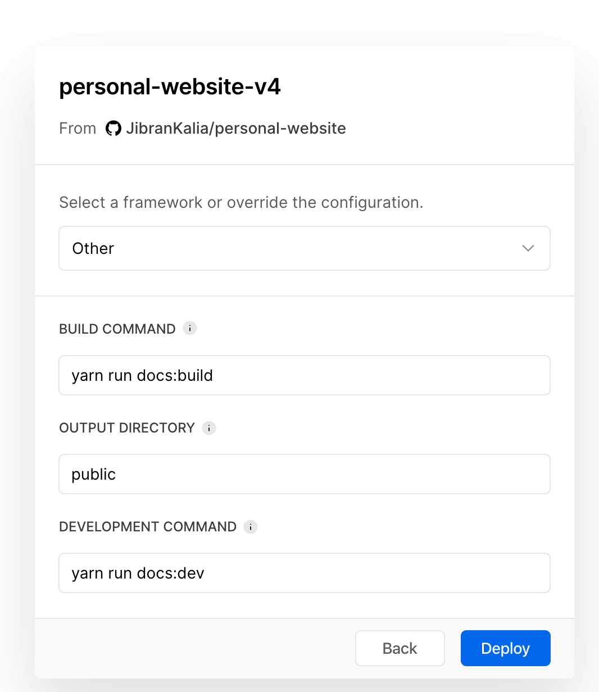

# Create a blog using VuePress (Part 2)

Continued from [Part 1](../create-a-blog-using-vuepress-part-1).

## Custom CSS

The next step is to modify the theme of the blog slightly. To do that, I created `.vuepress/styles/palette.styl` file:

```styl
$accentColor = #007acc
```

Furthermore, I wanted to remove this svg on all outbound links:


A simple inspect showed me that is was being set by this:

```css
.icon.outbound {
  color: #aaa;
  display: inline-block;
  vertical-align: middle;
  position: relative;
  top: -1px;
}
```

In order to hide that svg using CSS I created `.vuepress/styles/index.styl` file:

```styl
.outbound
  display:none !important
```

This was the result:


## Ordering posts

The last thing I wanted to achieve was to order the posts in reverse chronological order. I modified our original `PostList` Vue component to add a sort function:

```js{6-8}
computed: {
  posts() {
    const path = this.$page.path
    const posts = this.$site.pages
      .filter(p => p.path && p.path.startsWith(path) && p.path !== path)
      .sort((a, b) => {
        return new Date(b.frontmatter.date) - new Date(a.frontmatter.date)
      });
    return posts;
  }
}
```

## Deploying to Zeit Now

Finally, it was time to deploy my blog. For that, I used [ZEIT](https://zeit.co/). I [connected](https://zeit.co/import/git?tab=github) ZEIT to my GitHub account and pointed it to the correct repo. I then filled the following options:



and voila my website is live!
