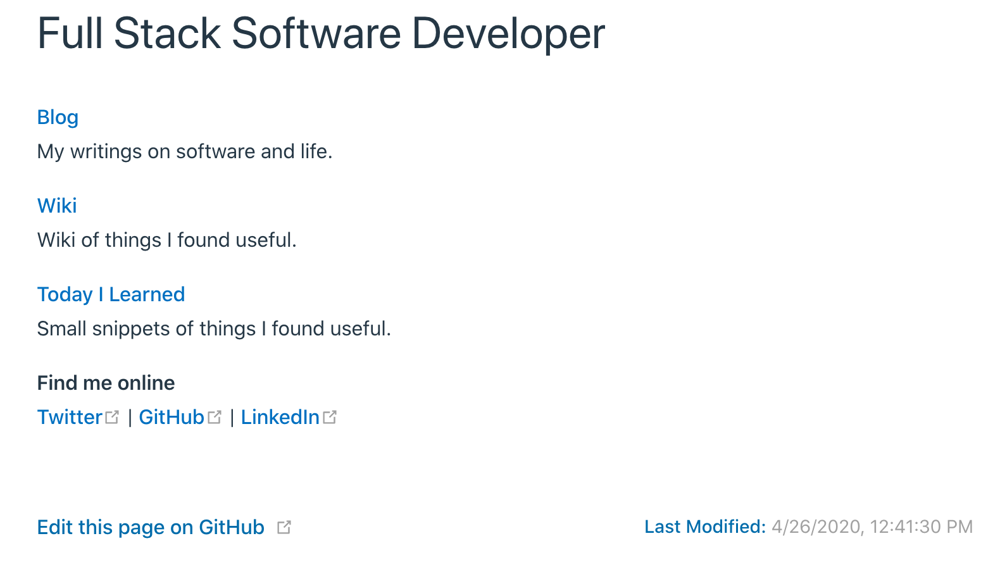

# Create a blog using VuePress (Part 3)

Continued from [Part 2](../create-a-blog-using-vuepress-part-2)

## Plausible

I wanted to add some basic visitor tracking. Instead of going with the default Google Analytics option. I decided to try out [Plausible](https://plausible.io/vs-google-analytics). The instructions said that I should add the following script in the head tag:
`<script async defer data-domain="jibrankalia.com" src="https://plausible.io/js/plausible.js"></script>`. I added it to [head option](https://vuepress.vuejs.org/config/#head) in config.js:

```js
// docs/.vuepress/config.js

['script', { async: true, defer: true, "data-domain": "jibrankalia.com", src: "https://plausible.io/js/plausible.js" }],
```

[Source](https://medium.com/@lassiuosukainen/how-to-include-a-script-tag-on-a-vue-component-fe10940af9e8)

## SiteMap

I also wanted to add a sitemap that I can submit to Google for better SEO.

I added the sitemap plugin

```shell
yarn add -D vuepress-plugin-sitemap
```

and modified the config.js:

```js
// docs/.vuepress/config.js

plugins: {
  'sitemap': {
    hostname: 'https://jibrankalia.com'
  },
}
```

## Last Updated

I wanted to have the Last Updated timestamp. I just modified the theme config to turn it on. Details are [here](https://vuepress.vuejs.org/theme/default-theme-config.html#last-updated).

```js
themeConfig: {
  lastUpdated: 'Last Modified',
}
```

I then modified the styling to my liking:

```styl
#app
.last-updated
  .prefix
    color: #1A76B7
```

## Edit on Github

Finally, I also wanted to add `Edit this page on Github` option at the bottom of the page. This feature is also included in the Default Theme. I modified the config following the instructions [here](https://vuepress.vuejs.org/theme/default-theme-config.html#git-repository-and-edit-links):

```js
// docs/.vuepress/config.js

themeConfig: {
  repo: 'JibranKalia/personal-website-v4',
  docsDir: 'docs',
  editLinks: true,
  editLinkText: 'Edit this page on GitHub',
}
```

I also changed the styling to match with the rest of the website.

```styl
#app
  main
    footer.page-edit
      div.last-updated
        span.prefix
          color: #1A76B7
      div.edit-link
        a
          color: #1A76B
```

Here is the final result:


