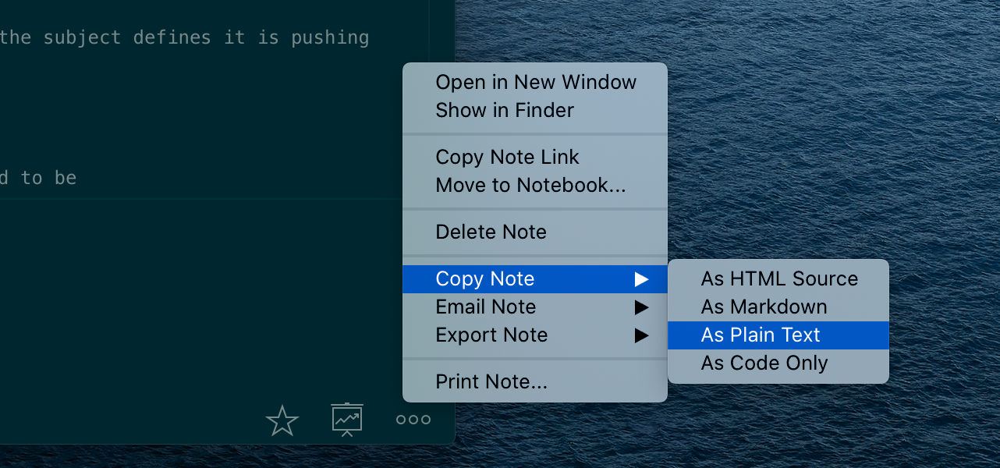

# Word Count in Quiver

From my [previous post](../note-taking-in-quiver) you might have noticed that I am a fan of [Quiver](https://happenapps.com). That being said there are some weird edge cases with the tool. One big one is that there is currently no way to get the word count. There is an open [feature request](https://github.com/HappenApps/Quiver/issues/396) to that effect.

Word count is an important vanity stat and so I found a quick workaround. I mostly write in markdown so this method works well for me.

Copy the note as plain text:

.

That will copy the note into your clipboard. Then from the terminal run this command:

`pbpaste | wc -w`

This will take the contents of the clipboard and pipe that to the [wc](https://github.com/tldr-pages/tldr/blob/master/pages/common/wc.md) and count the words.

Again this is not a perfect solution but it gets the job done in a pinch.
