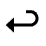

# Mac Keyboard Shortcut Symbols

Because I had to keep looking it up:

| Modifier key | Symbol                                              |
|--------------|-----------------------------------------------------|
| Command      |    |
| Shift        |        |
| Option       |      |
| Control      |    |
| Return       |      |
| Function     |  |

[Source](https://support.apple.com/guide/numbers/keyboard-shortcut-symbols-tan6f3e4ba25/mac)